# DevOps Assement Task

---

# Task 1

## 1. Explanation
According task1  I have setup 3  severs/VMs using Rocky Linux ISO `Rocky-10.2-x86_64-dvd1`

### Screenshot
> 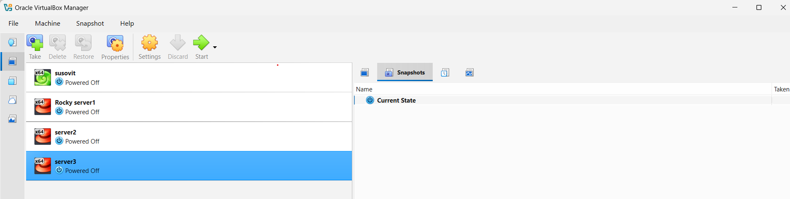

---

# Task 2

## 2.1 Explanation
Before creating rockeyserver 1 i have allocate resource according to task

### Screenshot
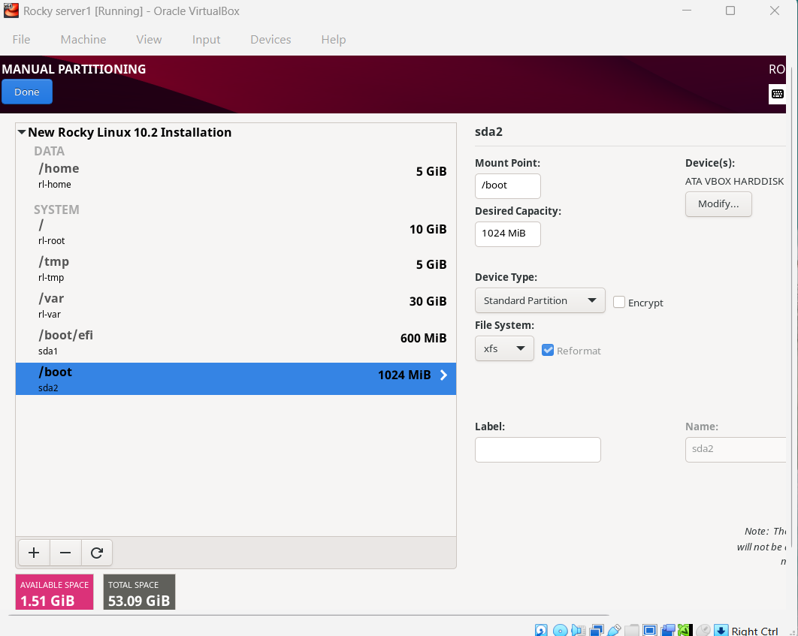
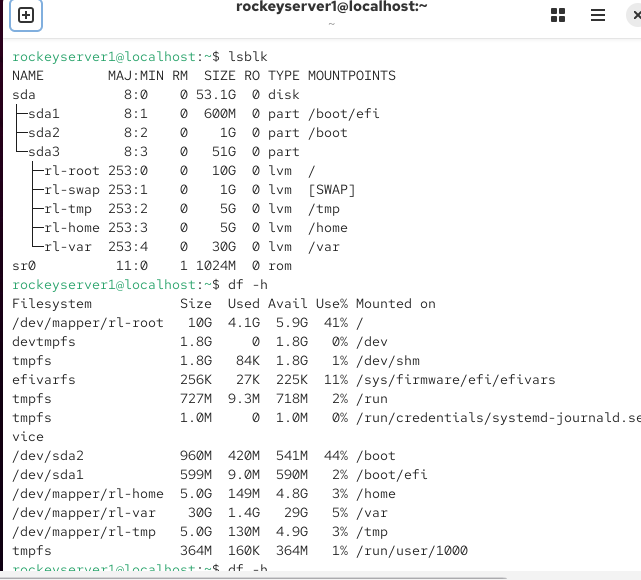

## 2.2 Explanation
A dedicated Host-Only network connection was configured on  using NetworkManager. The `enp0s8` interface was assigned the static IP address  for all server 192.168.56.102/24`,192.168.56.103/24  ,192.168.56.104 /24 and named`hostonly\` . Confirming that the server was prepared to communicate with the other virtual machines through the isolated Host-Only network.

### Screenshot

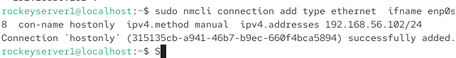

---

# Task 3

## 3.1 For server1

### 3.1.1 Explanation
Mysql 9.7 LTS Community Server was installed on server 1 using the official MySQL repository. Mysqld`service is **active and running** successfully.
### Screenshot
> 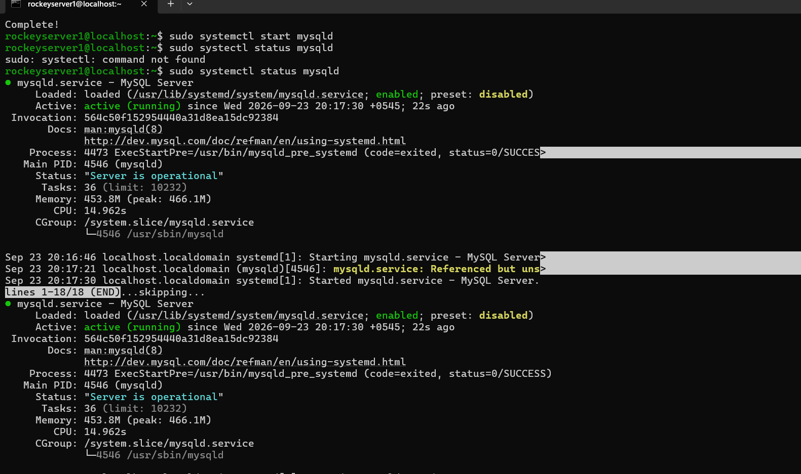

### 3.1.2 Explanation
A dedicated kine database and databaser user were created on the MySQL server for use by the k3s control plane external datastore. the Kine user was granted privileges only on the`kine\` database. The MySQL root account is not used by k3s.r6

### Screenshot
> 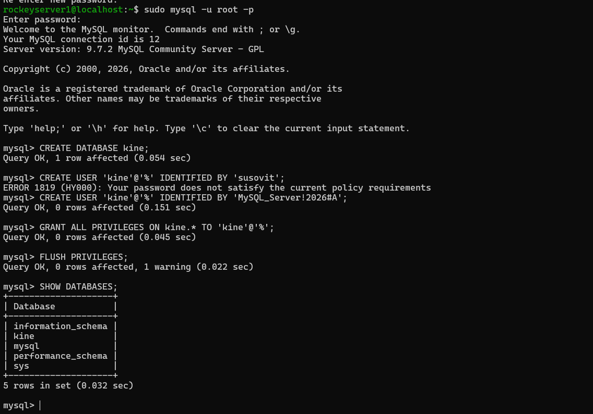

### 3.1.2 Explanation
MysqL port 3306 was secured using the firewall and restricted to server 2  Allows K3s/Kine to access the database while blocking unauthorized hosts.

### Screenshot
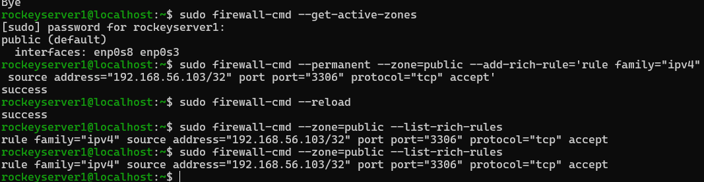
### 3.1.3 Explanation
The Kine Mysql user was resctricted to server2 to prevent unauthorized  database access

### Screenshot
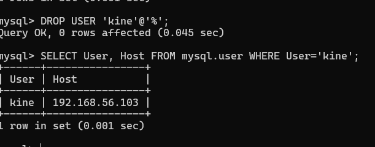

### 3.1.4 Explanation
Server2 successfull connected to server1 external mysql database using dedicated kine account and confirming the required database connectivity for k3s.

### Screenshot
> 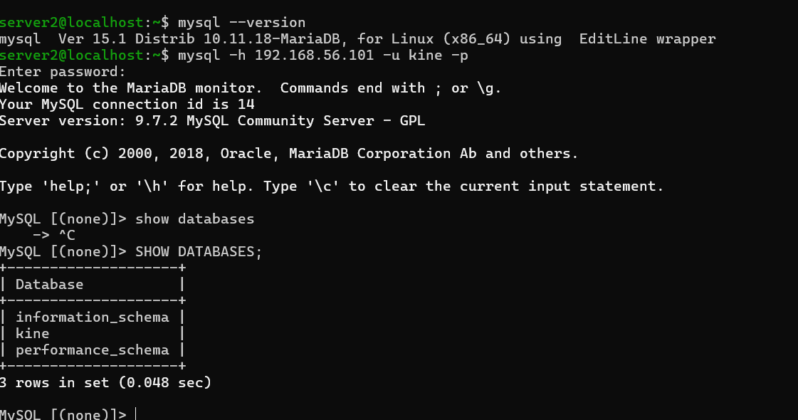

---

## 3.2 For server2

### 3.2.1 Explanation
Server 2 assigned the hostname k3s-master

### Screenshot
> 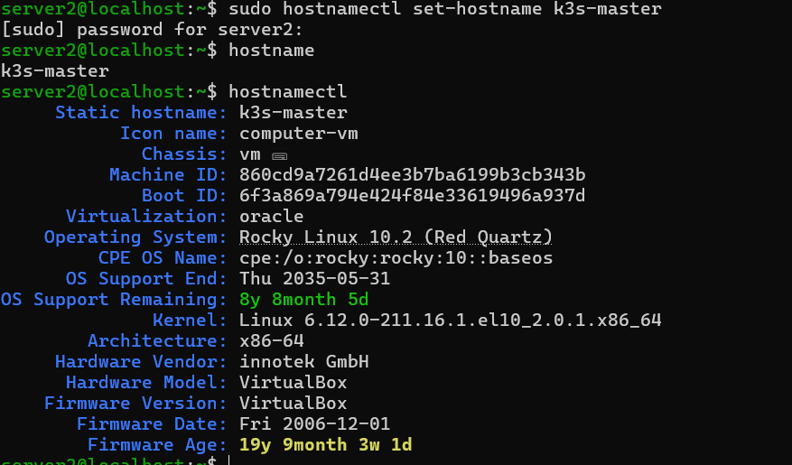

### 3.2.2 Explanation
The k3s control plane was sucessfully installed on server2 and configure to use the external mysql database on server 1 for kine

### Screenshot
> 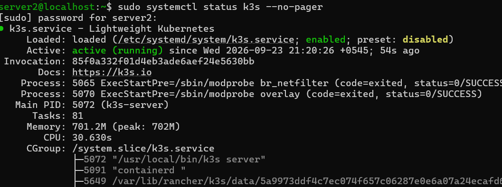`
> 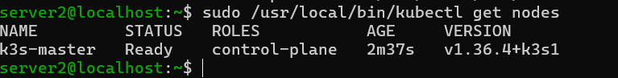

---

## 3.3 For server3

### 3.3.1 Explanation
Server 3 assigned the hostname k3s-worker

### Screenshot
> 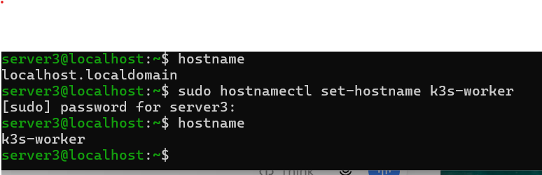

### 3.3.2 Explanation
K3s cluster was sucessfully established with server 2  and server 3 as worker node, and both of them communicate through host only network.

### Screenshot
> 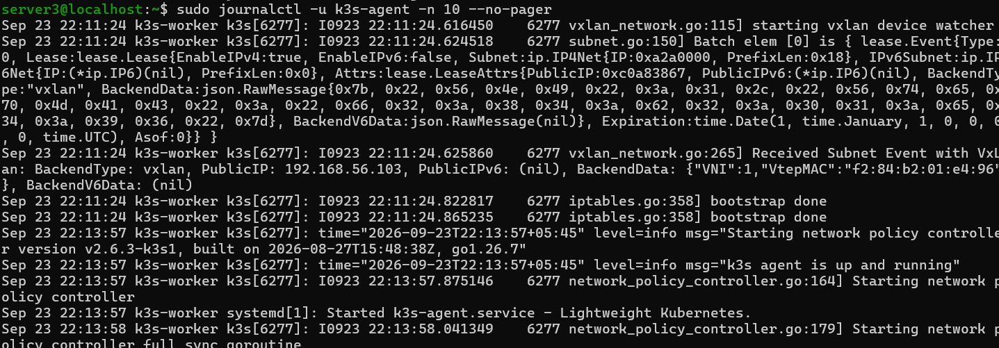
> 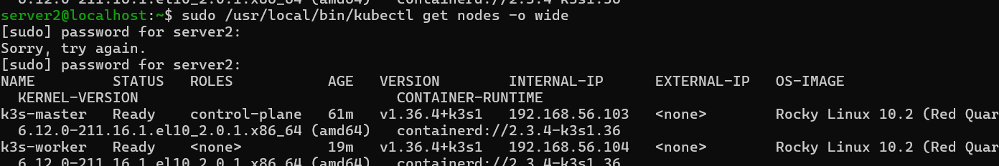

### 3.3.3 Explanation
A dedicated nginx namespace was created with restricted pod security standard to enforce stronger workload security.

### Screenshot
> 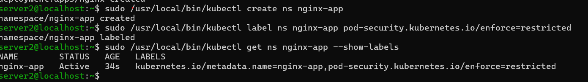

---

# Task 4

## 4.1 Explanation
Nginx is running with two replicas accros the k3s nodes and is exposed through Traefik on Http port 80 , while the service remains internal to the cluster

### Screenshot
> 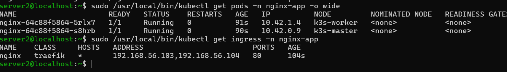

## 4.2 Explanation
Nginx was successfully deployed on k3s and exposed through traefik on port 80 and the application returned http 200 ok  confirm sucessful networking and routing.

### Screenshot
> 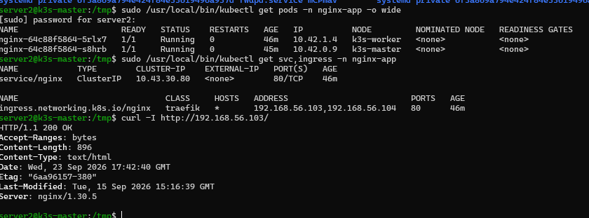
> 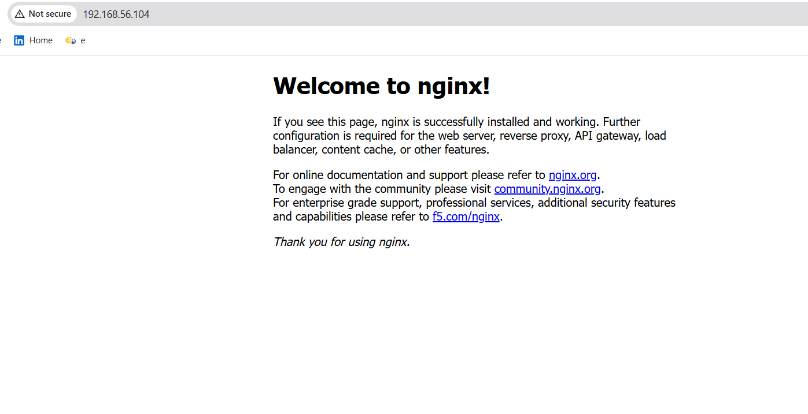

---

# Task 5

## 5.1 Explanation
Docker engine and docker compose were sucessfully installed and verified on the rockylinux server for deploying the harbor offline registry.

### Screenshot
> 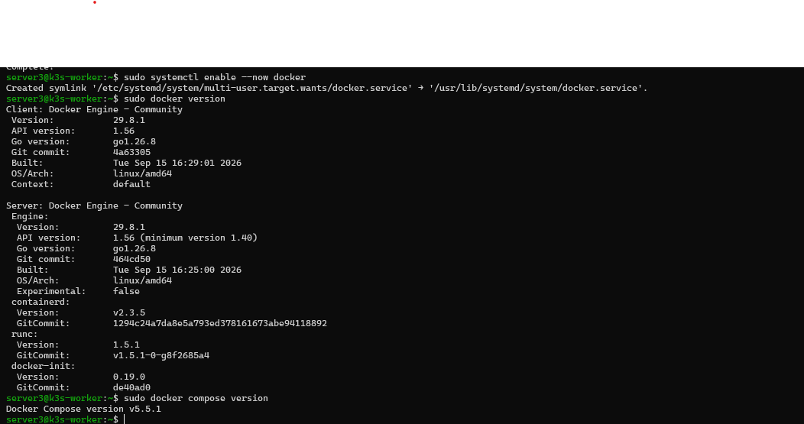

## 5.2 Explanation
The official harbor v2.14.4 offline installer was download including the pre-built images for offline deployment.

### Screenshot
> 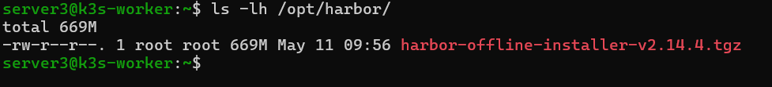

## 5.3 Explanation
Harbor v2.14.4 offline installer was sucessfully extracted on server3 including the configuration file ,installation script, and bundled container images

### Screenshot
> 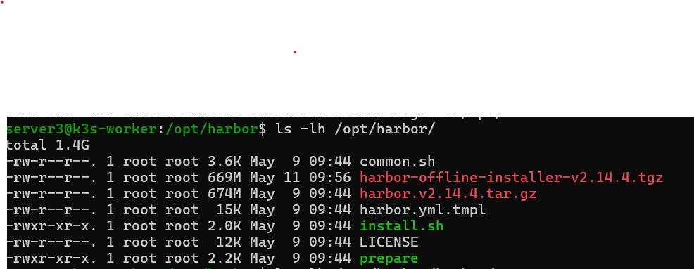

## 5.4 Explanation
Harbor v2.14.4 configuration was successfully prepared with https, hostname, and storage settings generating the required Docker compose configuration without errors.

### Screenshot
> 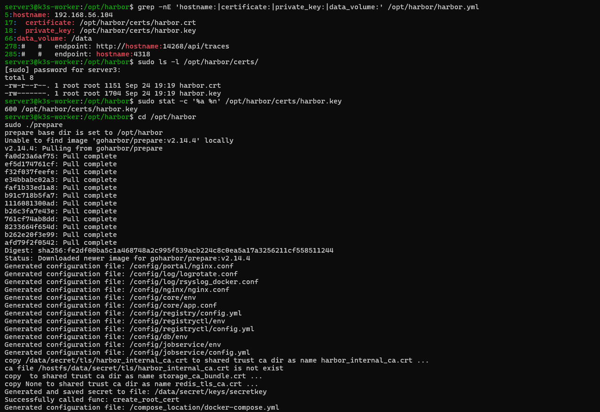

## 5.5 Explanation
Harbor v2.14.4 was successfully installed and required services running in healthy status.

### Screenshot
> 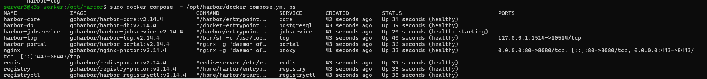

## 5.6 Explanation
Server 3 firewall rules restrict harbor HTTP/HTTPS access on ports 80 and 443 to the host only network.

### Screenshot
> 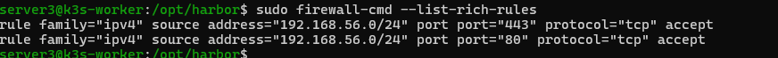

## 5.7 Explanation
Harbor web interface was successfully accessed over https at 192.168.56.104

### Screenshot
> 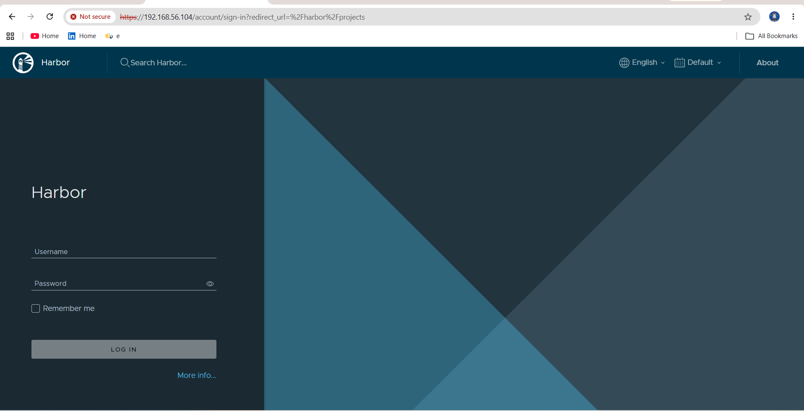

## 5.8 Explanation
Harbor dashboard

### Screenshot
> 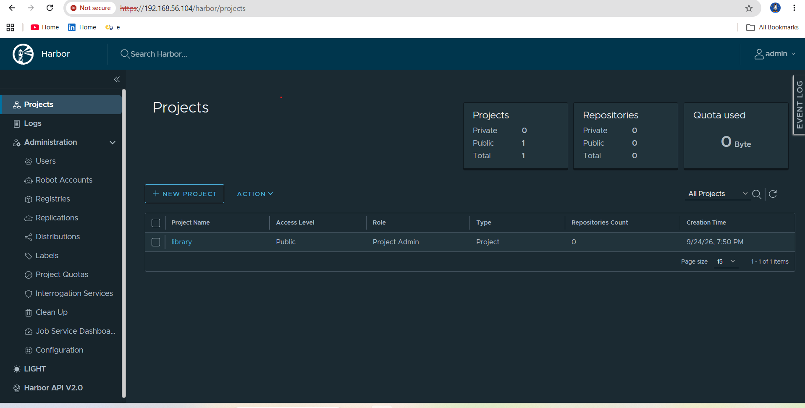

## 5.9 Explanation
Creating new project

### Screenshot
> 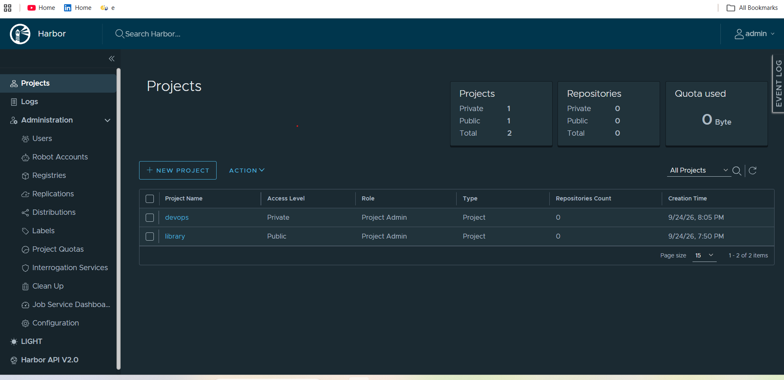

## 5.10 Explanation
Docker was configured to trust Harbor TLS certificate.

### Screenshot
> 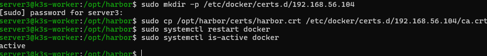

## 5.11 Explanation
Docker successfully authenticated to the private Harbor registry .

### Screenshot
> 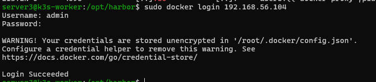

### Now  push small test image into my private devops project

## 5.12 Explanation
Nginx Alpine container image was successfully tagged and pushed to the private Harbor project `devops` using the HTTPS registry endpoint

### Screenshot
> 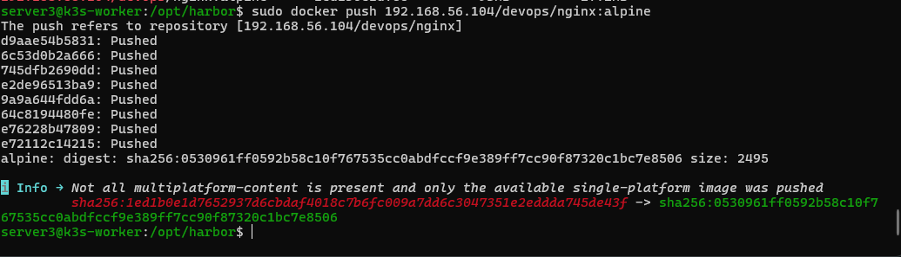

## 5.13 Explanation
The Harbor registry successfully received and stored the `nginx:alpine`

### Screenshot
> 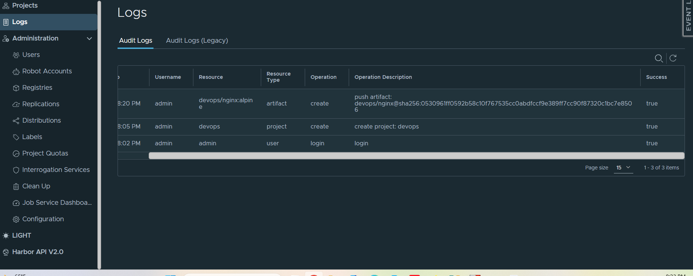

---

# Finally

## Successfull pull image

### Screenshot
> 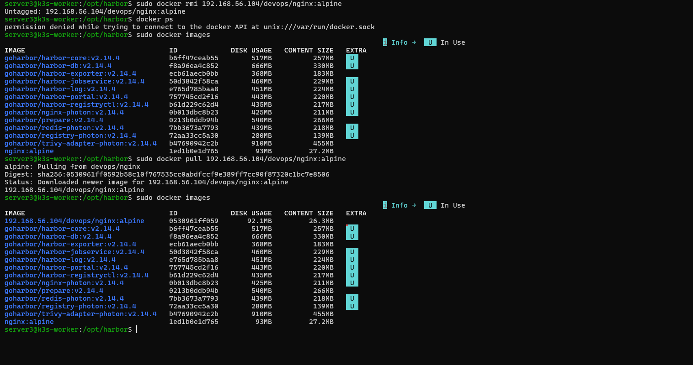
